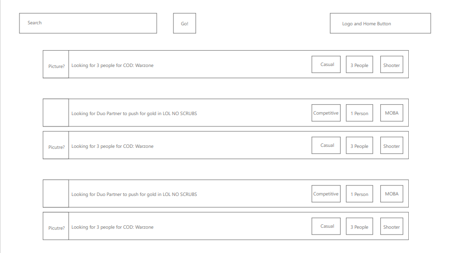
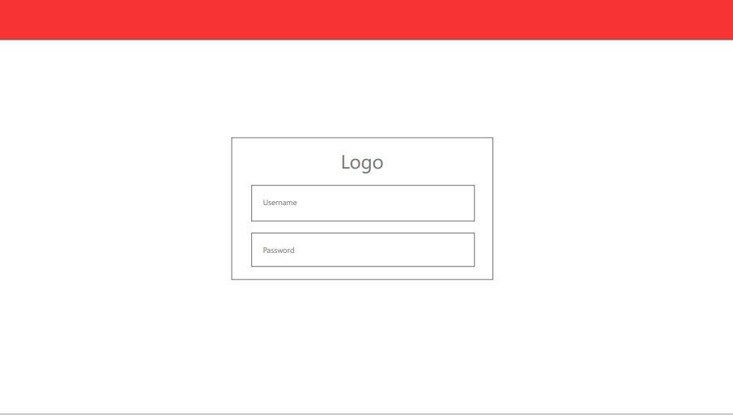
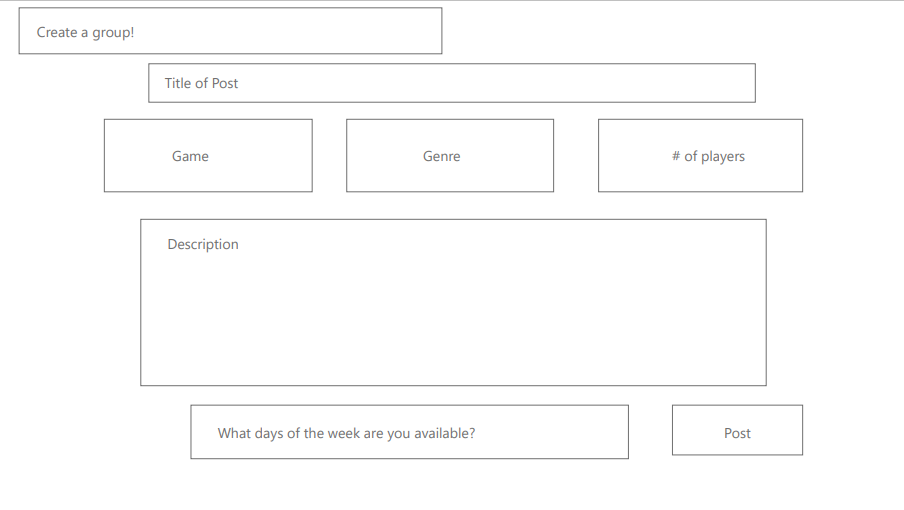
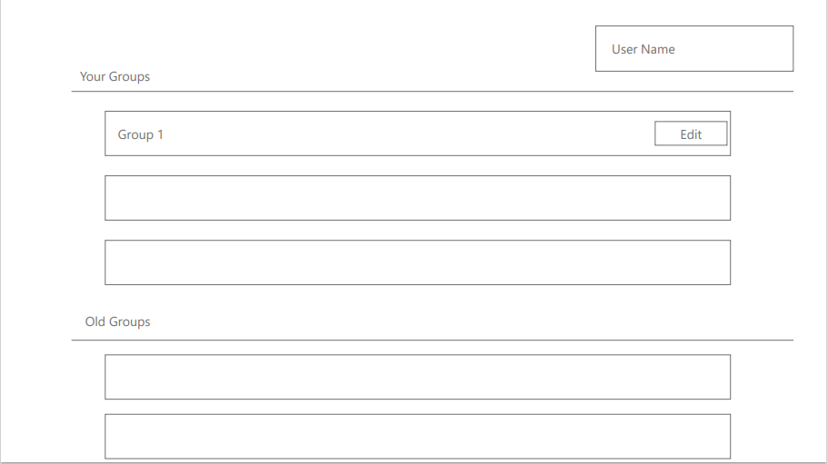
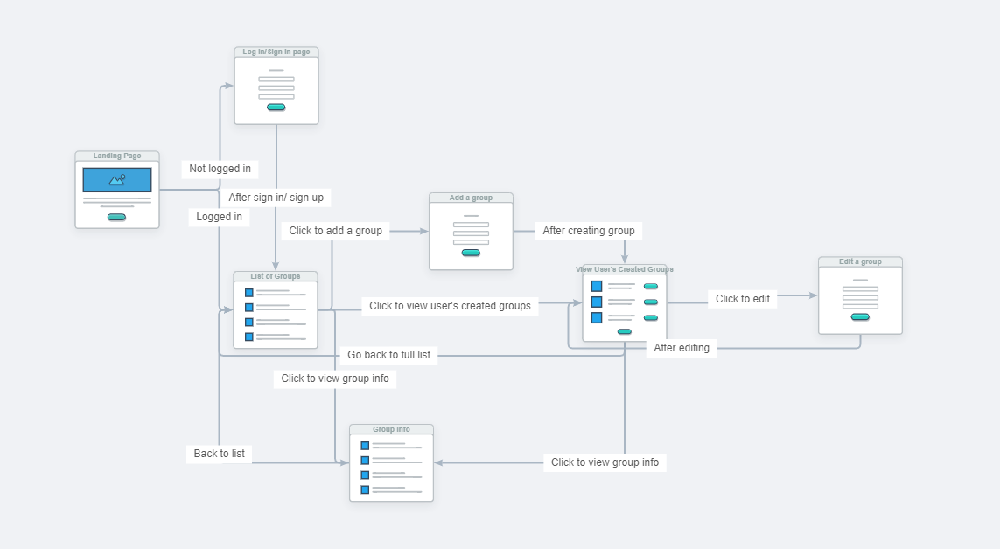

# project2

## Table of Contents

1. [Description](#Description)
2. [User Story](#UserStory)
3. [Elevator Pitch](#ElevatorPitch)
4. [Criteria](#Criteria)
5. [Wireframe](#Wireframe)
6. [User Flow](#UserFlowDiagram)
3. [Installation](#Installation)
4. [Usage](#Usage)
6. [Issues](#Issues)
7. [Credits](#Credits)
8. [License](#License)
9. [Questions](#Questions)

## Description

Gamer 4 Gamer - MVP
    - post a game group looking to find people to play with
    - look at available game listenings 
    - search for a game or genre that you are interested in
    - login to make a game group and see the contact info

    -stretch
        -comments on postings
        -Waitlist?

Database needs - Available Groups
    - Auto Increment ID KEY
    - Group Name
    - user
    - game name
    - genre
    - max group size (current size)
    - contact info (email, discord, psn, gamertag)
    - casual/competitive?
    - schedule

### Screenshots

## UserStory

    As a game player, I want a website that helps me find game groups to play with that will provide me what game they play, their schedule, their play style, and how to contact them.

## ElevatorPitch

    This website is made to provide an easier way for users to find or make groups for playing games together.

## Criteria

* Use Node.js and Express.js to create a RESTful API.

* Use Handlebars.js as the template engine.

* Use MySQL and the Sequelize ORM for the database.

* Have both GET and POST routes for retrieving and adding new data.

* Use at least one new library, package, or technology that we haven’t discussed.

* Have a folder structure that meets the MVC paradigm.

* Include authentication (express-session and cookies).

* Protect API keys and sensitive information with environment variables.

* Be deployed using Heroku (with data).

* Have a polished UI.

* Be responsive. (works on other size screens)

* Be interactive (i.e., accept and respond to user input).

* Meet good-quality coding standards (file structure, naming conventions, follows best practices for class/id naming conventions, indentation, quality comments, etc.).

* Have a professional README (with unique name, description, technologies used, screenshot, and link to deployed application).

## Wireframe

### Page - List

### Page - Login

### Page - Create a group

### Page - List of user's created groups

## UserFlowDiagram

## Installation

## Usage

## Issues

## Credits

## License

## Questions